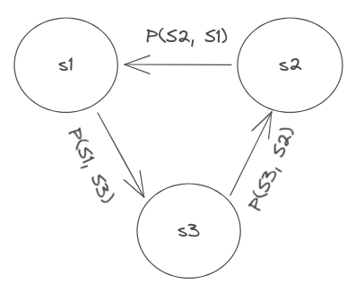

# Belief Network of Service States

## Overview
This is a presentation about a method for building a probabilistic model of a service with respect to its observable behavior in a distributed systems environment such as Kubernetes and how this model can be used to achieve an AI that can automate at least the following SRE skills.

1. **Troubleshoot** an existing service problem quantifiably.
2. **Predict** service behaviors quantifiably.
3. **Infer** service behaviors quantifiably.
4. **Detect** service behavior **anomalies** quantifiably.

By "**quantifiably**", this means the results of such skills are quantified with **numerical valuesof probabilities**.

## How It Started
This idea is a byproduct of my analysis and therefore study of my interests in the following topics.

1. **Behavior of Software Systems** - How software behaves in a production environment.
2. **Theories behind SRE** - This is a personal search and study about the fundamentals of Service (a.k.a. Site) Reliability Engineering so that SRE can be theoretically analyzed and therefore determine its fundamental models that can be applied in any SRE practice. I recorded my study in [srescience.com](https://srescience.com).

## Software Service as Finite-State-Machine
In my study of SRE, I chose the **finite-state-machine or FSM as the computational model for expressing a Software Service** or simply a Service. As a consequence, a service has the properties of an FSM such as **states and state transitions**, etc. I have also added the concept of **state variables** which what make up a state. A state is simply a set of state variables.

## A Service Reliability Equation
In one of my analysis of SRE, I attempted to express **Service Reliability** as objective and as agnostic as it can be with respect to existing service reliability implementations. This resulted to the following mathematical equation:

**SR = RW * Tr_Target**

**Tr_Target** = P(TrA, TrE)₀ * RW₀ + P(TrA, TrE)₁ * RW₁ + … P(TrA, TrE)ᵢ * RWᵢ

Where,

 - **SR** is Service Reliability
 - **RW** is a vector of reliability importance weights
 - **Tr_Target** are the weighted probabilities of actual service states complying with expected service states.
 - **P(TrA, TrE)** is a probability of compliance or a state transition.
 - **Tr** is state transition.
 - **TrA & TrE** are Tr actual and Tr expected respectively.

## State Transition and Probability
Based on the SR equation, a state transition can be expressed as a probability.

## FSM and Directed Graph
An FSM can be expressed as a directed graph where nodes and edges represent an FSM's states and state transitions respectively. 

## Service, Directed Graph, and Probability
Given the previous axioms, a service can be represented as a directed graph with edges that has probability values.

--Under Construction--
